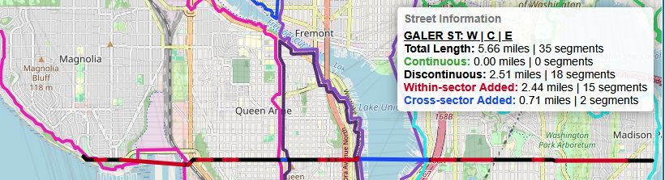

# Identifying Seattle's Discontinuous Streets
## Michael Babb, PhD
### Created: July 1, 2024
### Updated V1.0: December 31, 2024
### Updated V2.0: February 18, 2025

# Seattle's (discontinuous) Street Network
How many streets in Seattle are disconntinuous? Or, "How frequently do roads in Seattle, start, stop, and resume?" This typically looks like a road running for a few blocks, terminating, and then resuming a few blocks later. A prime example is Galer Street. Galer street is an east-west street that runs through the neighborhoods of Magnolia, Queen Anne, Capitol Hill, and Madison Park.  

[SEE THIS PAGE FOR v2.0 OF AN INTERACTIVE MAP OF THE ADDED STREETS](https://mike-babb.github.io/media/discontinuous_streets_v2.html)  
[SEE THIS PAGE FOR v1.0 OF AN INTERACTIVE MAP OF THE ADDED STREETS](https://mike-babb.github.io/media/discontinuous_streets.html)  

The streets colored black are the existing streets with discontinuities. The red lines are the "missing segments" joining the end of one section of a street to another. (Note: this color scheme of red and black is used throughout this project in the graphics and maps.) Galer is also separated into different streets based on city directional sector and road type. Accordingly, there are five streets that feature the name "Galer" and three out of those five streets feature a discontinuity. (The number of discontinuities is equal to the number of segments minus one. A segment is a portion of a street that runs for any length.) The table below summarizes the number of discontinuties in each street with 'Galer' in its name.

| Street Name | Segments | Discontinuities|
|---|----|---|
|E Galer ST | 5| 4|
|Galer PL N | 1| 0|
|Galer ST | 2| 1|
|W Galer ST | 5 | 4|
|W Galer ST Flyover | 1 | 0|

The streets with the name Galer differ based on street prefix and street type. E Galer Street is found in the eastern sector of the city (Capitol Hill) and W Galer is found in the western sector of the city (Magnolia and Queen Anne). The suffix 'ST' indicates the road is of type "street" - a navigatable road - while the suffix 'PL' indicates the road is of type "Place", a road - usually a dead end - that is accessible only from a larger street. One of the components driving the discontinuous streets is the different sectors of the city and when streets transition from one sector to another. ~~More on this in the future work section.~~ Version 2.0 features cross-sector connections!

# City Sectors
Seattle is divided into eight sectors, basesd on compass directions. The eight sectors can be seen in the image below.  
  

The map on the left features the sectors identified by direction prefix or direction suffix. Roads without a direction prefix or suffix are labeled as "No direction". The majority of roads without a direction prefix or direction suffix are located in the central business district. Throughout Seattle, streets run east/west and avenues run north/south. In the central business district, both streets and avenues are directionless. North of Denny way, streets are directionless while avenues are not. East of Broadway, streets feature a direction while avenues do not. Note that throughout the city, there are streets without a direction prefix or suffix, but this is limited to specific roads and road types (trails and interstates, for example). The image on the right is the convex hull surrounding each directional prefix / suffix (after removing certain roads and types). Before starting this project, I had a general idea about the extents of the city sectors. These maps was helpful in diagnosing why some roads were being connected and some where not. [Step 01](/code/step_01_import_export_street_data.ipynb) and [step 02](/code/step_02_export_nodes_seattle_streets.ipynb) identifies the city sectors on the streets and creates the convex hulls. And new for version 2.0, I create concave hulls in step 02 and I create non-overlapping sectors using these concave hulls in [step 11](/code/step_11_prep_for_webmap.ipynb).  

# Data
The data powering this analysis is a single GeoPackage from the [City of Seattle](https://data-seattlecitygis.opendata.arcgis.com/datasets/783fd63545304bdf9d3c5f2065751614_0/explore).  

These are the streets in and near the City of Seattle. This dataset appears to be updated frequently, so I saved the version I downloaded on 2024/11/09 at 5:20 PM into the [data](/data/Street_Network_Database_SND_5117857036965774451.gpkg) folder of this repo.  

# The technique
The majority of the work carried out to the find discontinuities in Seattle streets is accomplished across four Jupyter notebooks (steps 01 through 04) with the seven remaining notebooks containing additional data formatting and analyses.
* [step_01_import_export_street_data.ipynb](/code/step_01_import_export_street_data.ipynb)
* [step_02_export_nodes_seattle_streets.ipynb](/code/step_02_export_nodes_seattle_streets.ipynb)
* [step_03_merge_data.ipynb](/code/step_03_merge_data.ipynb)
* [step_04_find_discontinuities.ipynb](/code/step_04_find_discontinuities.ipynb)
* [step_05_prepare_graphs_and_stats.ipynb](/code/step_05_prepare_graphs_and_stats.ipynb)
* [step_06_draw_an_nx_graph.ipynb](/code/step_06_draw_an_nx_graph.ipynb)
* [step_07_format_data_for_v2_plot_single_streets.ipynb](/code/step_07_format_data_for_v2_plot_single_streets.ipynb)
* [step_08_format_data_for_v2_plot_street_groups.ipynb](/code/step_08_format_data_for_v2_plot_street_groups.ipynb)
* [step_09_compare_edge_differences.ipynb](/code/step_09_compare_edge_differences.ipynb)
* [step_10_update_central_streets.ipynb](/code/step_10_update_central_streets.ipynb)
* [step_11_prep_for_webmap.ipynb](/code/step_11_prep_for_webmap.ipynb)

In `step 01`, the downloaded street network data is loaded as a GeoPandas GeoDataFrame and I perform some moderate data cleaning. `Step 02` features additional data pre-processing and the creation of the city sectors as seen in the figure above. After removing certain types of roads and selecting only roads within the City of Seattle, the count of segments decreases from ~34K to ~27K across 2,457 unique roads. In this case, a unique road includes both the road name, the road type, and direction prefix or suffix. Under this schema, W GALER ST is not the same as GALER ST which is not the same as E GALER ST. In `Step 04` I use [GeoPandas](https://geopandas.org/en/stable/getting_started/introduction.html) and [NetworkX](https://networkx.org/) to identify discontinuous streets and create segments joining the discontinuous streets. There are ~~four~~ five NetworkX libraries I use to identify the discontinuous streets:
* [nx.from_pandas_edgelist()](https://networkx.org/documentation/stable/reference/generated/networkx.convert_matrix.from_pandas_edgelist.html) to create an undirected graph (nodes are intersections, edges are roads)
* [nx.connected_components()](https://networkx.org/documentation/stable/reference/algorithms/generated/networkx.algorithms.components.connected_components.html) to identify discontinuities in the graph (discontinuous roads)
* [nx.non_edges()](https://networkx.org/documentation/stable/reference/generated/networkx.classes.function.non_edges.html) to compute the set of possible edges to add (many possible ways to connect discontinuous street ends)
* [nx.k_edge_augmentation()](https://networkx.org/documentation/stable/reference/algorithms/generated/networkx.algorithms.connectivity.edge_augmentation.k_edge_augmentation.html) to find the optimal edge to add (the path between discontinuous street ends guaranteeing full graph traversal)
* [nx.degree_centrality()](https://networkx.org/documentation/stable/reference/algorithms/generated/networkx.algorithms.centrality.degree_centrality.html#networkx.algorithms.centrality.degree_centrality) is used to fine-tune the edge weighting so that street-ends are connected to street-ends. This is new to v2.0 and in practice, this means that a little over 30 streets have slightly different connectivity. See `step 09` for this analysis.

I then use various [shapely](https://shapely.readthedocs.io/en/stable/manual.html) objects to build the missing street segments as geospatial data and GeoPandas to collect and store these data. In `step 05`, I conduct a series of analyses to better understand the distribution of the added streets. I write out several worksheets to an Excel workbook in order to get a sense of the types of streets in Seattle. In particular, I create a histogram of the added segements. Most added segments are short: the average added segment length is a little less than a quarter of a mile. `Step 06` is a utility file that shows how to create a simple plot of W Galer ST as a NetworkX graph.

`Steps 07 and 08` are utility files that shape data, conduct some analyses, and produce plots. `Step 07` plots 412 single streets used in visual inspection. While it was rather trivial to connect the streets within a city sector, some of the cross-sector connections were less trivial and required manual identification of the groups. This [file](./data/street_groups_working.xlsx) showcases the output of this manual identification. A reason for this file can be seen in [51ST street](./graphics/ex_07_51.png). A crude approach is to connect all of the street segments. A more sophisticated approach is to connect the segments in the northern sectors and then the segments in the southern sectors. But 51ST runs north-south and so I should probably connect the streets in the northeast sector to the streets in the south sector. And while I eventually coded that logic, it was far faster - and ultimately easier - to implement the appropriate grouping from the beginning. This also meant that I wasn't implementing some logic and then manually checking it later. A similar problem, after identifying how each street group should be connected, I needed to understand larger group patterns. `Step 08` produces plots of the different streets by type (RD, PL, ST, AVE) and city sector group. The plots produced in `step 08` were also used in understanding how to order the different sectors. The ordering in general ranges from top-to-bottom and left-to-right. However, this is subject to the type of street. Recall that STREETS run north-south and AVENUES run east-west. Both `step 07` and `step 08` were helpful in diagnosing the outliers and making some (arbitrary) decisions about connectivity. For example, I decided that streets of type PL should only be connected within sector. And while connectivity for [10TH AVE](./graphics/ex_16_10th_ave.png) seems fairly obvious, applying that same connectivity logic to [9TH AVE](./graphics/ex_17_9th_ave.png) makes for odd looking connectivity in the north-north center-center-south sectors. Further underscoring the somewhat arbritrary nature of the cross-sector street connectivity is [Nebraska ST](./graphics/ex_18_nebraska.png). There is a Nebraska ST in Discovery Park in the western portion of Magnolia. There is also a Nebraska ST in Georgetown, running between Airport Way South and Corson Avenue South. Both street segments are short: about 700 feet and 975 feet, respectively. Are these street segments parts of the same street? Without research into the city archives to discern the provenance of street names, it's hard to say. Ultimately, I strove for consistency when creating the cross-sector connections and so streets with the same name are connected across sectors. 

In `step 09` I compare the edge differences between v1.0 and v2.0 of the within-sector added streets. Because I removed stubby segments in v2.0, the difference in added road length is approximately 0.5 fewer miles in version 2.0 across a little more than 30 streets. Given the way I set up the `nx.k_edge_augmentation()` this is not surprising as the weight used for the shortest path is the weighted geographic length of the to-be-added segements. 

In `step 10`, I perform some data analysis to better curate the list of streets that should be included in the list of streets in the central business district without a prefix direction or suffix. The output from this file is fed back into `step 02`. Finally, in `step 11`, I shape and format the data for use in a web map. Of note is the technique I used to create inner-ring buffers. In the [web map](https://mike-babb.github.io/media/discontinuous_streets_v2.html), I have added the outlines of the various city sectors. In order to make the boundaries of the sectors more legible, I created a series of inner-ring buffers that compress the outlines of each sector.

Throughout this project I used this [qGIS map](./maps/seattle_streets.qgz) file to showcase many aspects of the added streets. This map is fully symbolized and after running all of the notebooks, the layers should load appropriately. The image below is an overall picture of the addded streets. Again, the red lines are the added streets joining discontinuous segements and the black lines are the existing streets. In v2.0, the blue lines are the lines connecting streets that cross the different city sectors: a street crossing from the West sector of the city to the East sector of the city.  

At the scale of the city - and due to the number of added street connections - it's hard to get a sense of the number of added streets. This image below is centered on north Capitol Hill and showcases many within-sector street discontinuities (check out Galer from West to East, in particular).  

This image is illustrative of many of the reasons for the discontinuties in Seattle:  
* Seattle’s topography
* Water features
* Parks / campuses / large plots of land
* Seattle’s development from downtown to current day boundaries 
* Annexation of older cities (differently aligned grids)
* State routes (520 / HW 99) and I-5  

## Facts about the streets added:
* 2,453 uniquely named roads in the study area | 1,890 road miles: see these graphics for a comparison of [miles](/graphics/barplot_miles.png) and [road segments](/graphics/barplot_segment_count.png)  
* 1,145 roads without discontinuities | 312 road miles  
* 1,308 roads with discontinuities | 1,578 road miles  
* 3,617 within-sector segments added across 1,103 roads | 833 miles  
* 410 cross-sector segments added across 313 roads | 824 miles
* Average of ~3.3 within-sector segments added per uniquely named road  
* Average of ~1.3 cross-sector segments added per uniquely named road  
* Average added within-sector segment length: ~0.23 Miles  
* Average added cross-sector segment length: ~2.0 Miles  
* Median added within-segment length: ~448 Feet  
* Median added cross-segment length: ~1.1 Miles  
* Greatest number of within-sector segments added: [14 1ST AVE NW](/graphics/ex_14_most_added_segments_v2.png)  
* Longest within-sector segment: ~5 Miles:  [7TH PL S (10 longest added segments)](/graphics/ex_15_longest_added_segments_v2.png)  
* Shortest within-sector segment: ~4 Feet: [SW CLOVERDALE ST ](/graphics/ex_06_shortest_segment.png)  

I particularly like the image of SW CLOVERDALE ST because it exemplifies how connectivity is in part a function of mode of travel. Clearly, a pedestrian can navigate around that barrier while a vechicle cannot.  

Below is a histogram of the added streets:
  
This figure features a number of descriptive statistics showcasing the distribution of the length of the added segments. In general, most of the added segments are rather short, less than a quarter of a mile. Of all the added segments (3,617), 95% are less than one mile. `Step 05` creates this histogram, histograms for each street type, and additional summary graphics.  

See this [file](/graphics/histogram_cs_ALL_streets.png) for a histogram of the cross-sector added streets. In general, the cross-sector added streets are longer (2.0 miles, on average) because the added segments cross water bodies. However, there are some short cross-sector segments with the shortest being 41 feet. This histogram is also created in `Step 05`.

# File Tree and File Description 
├── README.md - This file  
├── code  
│   ├── run_constants.py - file paths used throughout the notebooks.  
│   ├── step_01_import_export_street_data.ipynb - import data and perform minimal formatting.  
│   ├── step_02_export_nodes_seattle_streets.ipynb - curate the set of working streets, create the city sectors.  
│   ├── step_03_merge_data.ipynb - merge data generated in steps 07 and 08.  
│   ├── step_04_find_discontinuities.ipynb - use NetworkX to identify discontinuities and create the added segments.  
│   ├── step_05_prepare_graphs_and_stats.ipynb - conduct analyses on the added segments.  
│   ├── step_06_draw_an_nx_graph.ipynb - plot a NetworkX graph object of Galer. The plot changes everytime the code is run.  
│   ├── step_07_format_data_for_v2_plot_single_streets.ipynb - generate plots of individual streets for manual review.  
│   ├── step_08_format_data_for_v2_plot_street_groups.ipynb - generate plots of groups of streets of manual review.  
│   ├── step_09_compare_edge_differences.ipynb - compare differences between the added segments in v1 and v2.  
│   ├── step_10_update_central_streets.ipynb - curate the list of streets in the central business district.  
│   ├── step_11_prep_for_webmap.ipynb - create non-overlapping polygons and inner ring buffers and export data for use in a webmap.  
│   └── utils.py - functions used throughout the notebooks.  
├── data  
│   ├── Seattle_City_Limits_3136622578314448116.gpkg - Seattle City Limits downloaded from the City of Seattle. Only used in the qGIS map.  
│   ├── Street_Network_Database_SND_5117857036965774451.gpkg - Stree Network downloaded from the City of Seattle. This is the starting file.    
│   ├── blank_street_type_working.xlsx - Roads with a manually created classifications. Used to ensure that every road has a classification (AVE, WAY, PL, for example.)  
│   ├── city_sector.csv - list of SND and corresponding city sector.  
│   ├── city_sector_check_working.xlsx - list of combined city sectors and a manually updated sort order of the combination.  
│   ├── state_name.csv - list of state names, used in a trivial analysis in Step 07.  
│   ├── street_groups_working.xlsx - list of streets and manually curated street groups.  
│   ├── streets_to_remove.txt - a list (1, as of 2025/2/23) of short segments from the original data that can be removed. This is most likely an erronneous data artifact inadvertently left in during data processing by the City of Seattle. This were discovered by panning around a qGIS map visually identifying oddities. I have no doubt there are more to discover. In step 02, this file can be loaded and used to remove the erroneous segments. In v1, there were a lot more of these stubby segments. In v2, I set the `segment_type = 1` and removed all of the stubby streets as well.  
│   └── toss_snd.csv - additional street segments that can be removed from processing, used in step 10  .
├── graphics  
│   ├── barplot_miles.png - barplot of the total miles by road type and road status.  
│   ├── barplot_segment_count.png - barplot of the total number of segments by road type and road status.  
│   ├── ex_01_galer.png - v2 street segments added to GALER ST.  
│   ├── ex_02_overall.png - v2 street segments added across the City of Seattle.  
│   ├── ex_03_north_capitol_hill.png - v2 street segments added in north Capitol Hill.  
│   ├── ex_04_most_added_segments.png - v2 streets with the most added segments.  
│   ├── ex_05_longest_added_segments.png - v2 street with the longest added segments.  
│   ├── ex_06_shortest_segment.png - screenshot of the shortest added segment.  
│   ├── ex_07_51.png - v2 street segments added for all roads named 51st.  
│   ├── ex_08_15th_ave_w.png - erroneous segments on 15th AVE W.  
│   ├── ex_09_sw_florida_st.png - erroneous segments on SW FLORDIA ST.  
│   ├── ex_10_woodlawn_ave_n.png - v1 connectivity for WOODLAWN.  
│   ├── ex_11_galer_v2.png - v2 connectivity for GALER.  
│   ├── ex_12_overall_v2.png - v2 overall connectivity.  
│   ├── ex_13_north_capitol_hill_v2.png - v2 connectivity for north Capitol Hill.  
│   ├── ex_14_most_added_segments_v2.png - v2 connectivity for streets with the most added segments.  
│   ├── ex_15_longest_added_segments_v2.png - v2 connectivity for streets with the longest added segments.  
│   ├── ex_16_10th_ave.png - v2 connectivity for 10TH AVE.  
│   ├── ex_17_9th_ave.png - v2 connectivity for 9TH AVE.  
│   ├── ex_18_nebraska_st.png - v2 connectivity for NEBRASKA ST.  
│   ├── histogram_cs_ALL_streets.png - histogram for all cross-sector added segments.  
│   ├── histogram_cs_AVE.png - histogram of cross-sector added segments for streets of type AVE (avenue).  
│   ├── histogram_cs_BLVD.png - histogram of cross-sector added segments for streets of type BLVD (boulevard).  
│   ├── histogram_cs_CT.png - histogram of cross-sector added segments for streets of type CT (court).  
│   ├── histogram_cs_DR.png - histogram of cross-sector added segments for streets of type DR (drive).  
│   ├── histogram_cs_RD.png - histogram of cross-sector added segments for streets of type RD (road).  
│   ├── histogram_cs_ST.png - histogram of cross-sector added segments for streets of type ST (street).  
│   ├── histogram_cs_WAY.png - histogram of cross-sector added segments for streets of type WAY (way).  
│   ├── histogram_ws_ALL_streets.png - histogram of all within-sector added segments.  
│   ├── histogram_ws_AVE.png - histogram of within-sector added segments for streets of type AVE (avenue).  
│   ├── histogram_ws_BLVD.png - histogram of within-sector added segments for streets of type BLVD (boulevard).  
│   ├── histogram_ws_CT.png - histogram of within-sector added segments for streets of type CT (court).  
│   ├── histogram_ws_DR.png - histogram of within-sector added segments for streets of type DR (drive).  
│   ├── histogram_ws_LN.png - histogram of within-sector added segments for streets of type LN (lane).  
│   ├── histogram_ws_PKWY.png - histogram of within-sector added segments for streets of type PKWY (parkway).  
│   ├── histogram_ws_PL.png - histogram of within-sector added segments for streets of type PL (place).  
│   ├── histogram_ws_RD.png - histogram of within-sector added segments for streets of type RD (road).  
│   ├── histogram_ws_ST.png - histogram of within-sector added segments for streets of type ST (street).  
│   ├── histogram_ws_WAY.png - histogram of within-sector added segments for streets of type WAY (way).  
│   └── seattle_sections.png - maps of the sectors in the City of Seattle.  
├── maps  
│   ├── all_streets_diss_v2.geojson - continuous, discontinous, and added roads in geojson format.  
│   ├── city_sector_lines.geojson - city sector outlines for use in the webmap  
│   ├── discontinuous_streets_v2.html - interactive webmap featuring the continuous, discontinous, and added roads.  
│   ├── seattle_streets.qgz - qGIS map showcasing different aspects of the added street types.  
│   └── street_layer_file.qml - qGIS layer file for easy street symbology  
└── seattles_disconnected_streets_2024_11_20.pptx - Presentation I gave to the [CUGOS](https://cugos.org/) group on November 20, 2024 showcasing the motivation, findings, limitations and next steps of this project. This presentation encompasses a lot of the work as described in this `README.md` file.  

# Future work
Making v1.0 of this repo publically availably was my first goal. My next two goals are as follows:  
1. ~~Create an interactive webmap to embed the results.~~  
[Click here for v2 of an interactive webmap](https://mike-babb.github.io/media/discontinuous_streets_v2.html)  
[Click here for v1 of an interactive webmap](https://mike-babb.github.io/media/discontinuous_streets.html)  

2. ~~Ensure connectivity is street-end to street-end.~~ *v2.0 features street-end to street-end connectivity!*   [nx.k_edge_augmentation()](https://networkx.org/documentation/stable/reference/algorithms/generated/networkx.algorithms.connectivity.edge_augmentation.k_edge_augmentation.html) is phenomenal and very fast, especially when a pool of candidate edges of supplied. Those weight of the candidate edges is the straigt-line distance between any two nodes. Sometimes, the shortest edge connecting two discontinuous street segments is not street-end to street-end but sometimes street-end to mid-point. This is rare, but it has been observed upon visual inspection. This image showcases this phenomenon:  
  
One way to fix this is to use the [nx.degree_centrality](https://networkx.org/documentation/stable/reference/algorithms/generated/networkx.algorithms.centrality.degree_centrality.html#networkx.algorithms.centrality.degree_centrality) to further winnow down the list of nodes that can be used to form connections between disconnected segments. The more connected the node, the more "central" is the node. In general, the nodes at the end of the street are going to be less connected than the nodes in the center of the road. Definitely something to incorporate in v2.0.  

3. ~~Connect streets based on name, not just street type.~~  *v2.0 features cross-sector connectivity!*  While it's easy to see that a case could be made to connect Galer across the city, other streets are less obvious. For example, there are many streets with the name '51st'. The image below showcases this phenomenon:  
  
There are five streets that include 51st in the name: NE 51st ST, 51st AVE NE, 51st AVE SW, and 51st AVE S, and 51st PL S. (Only 4 are shown at this scale; 51st PL S is obscured by 51st AVE S.) Should 51st AVE S and 51st AVE NE be connected? Perhaps! Upon visual inspection, the two streets align to a quasi-grid. But then, so do most of the streets in Seattle. Version 2.0 will feature connections between streets that should mostly likely be connected. For example, W GALER ST will connect to GALER ST which will connect to E GALER ST. The best way to accomplish this is through a combination programmatic identification and manual review to create the template for the street connections. 

